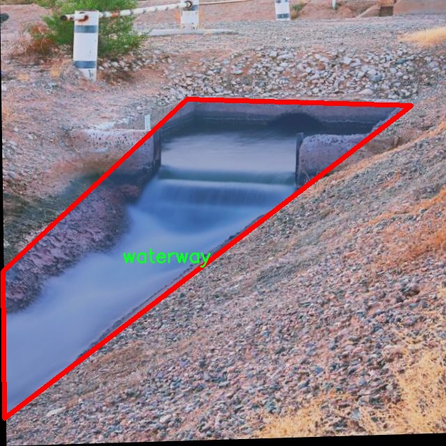

# 水道图像分割系统： yolov8-seg-EfficientHead

### 1.研究背景与意义

[参考博客](https://gitee.com/YOLOv8_YOLOv11_Segmentation_Studio/projects)

[博客来源](https://kdocs.cn/l/cszuIiCKVNis)

研究背景与意义

随着城市化进程的加快，水道系统在城市生态环境和交通运输中扮演着越来越重要的角色。水道不仅是城市排水和灌溉的主要通道，还在防洪、生态保护和景观美化等方面发挥着不可或缺的作用。因此，准确识别和分割水道图像对于水资源管理、环境监测和城市规划等领域具有重要的实际意义。然而，传统的水道图像处理方法往往依赖于人工标注和经验规则，效率低下且容易受到人为因素的影响，难以满足现代化管理的需求。

近年来，深度学习技术的迅猛发展为图像分割任务提供了新的解决方案。YOLO（You Only Look Once）系列模型因其高效的实时检测能力而广泛应用于目标检测和图像分割领域。YOLOv8作为该系列的最新版本，结合了更先进的网络结构和优化算法，能够在保持高精度的同时显著提高处理速度。然而，尽管YOLOv8在一般目标检测任务中表现出色，但在特定应用场景下，如水道图像分割，仍然存在一定的局限性。因此，基于改进YOLOv8的水道图像分割系统的研究具有重要的理论和实践意义。

本研究的核心在于构建一个高效的水道图像分割系统，利用3800张标注良好的水道图像数据集，针对水道这一特定类别进行深入的分析与处理。该数据集不仅涵盖了丰富的水道图像信息，还为模型的训练和验证提供了坚实的基础。通过对YOLOv8模型的改进，结合实例分割技术，我们旨在提高水道图像的分割精度，进而实现对水道的精准识别与分析。

在理论层面，本研究将推动水道图像处理领域的学术发展，探索深度学习在特定环境下的应用潜力。同时，通过对YOLOv8的改进，研究将为图像分割技术的进一步优化提供新的思路和方法。在实践层面，研究成果将为城市水道管理、环境监测及相关领域提供技术支持，助力实现智能化的水资源管理与环境保护。

综上所述，基于改进YOLOv8的水道图像分割系统的研究，不仅能够提升水道图像处理的效率和准确性，还将为相关领域的科学研究和实际应用提供重要的参考价值。通过这一研究，我们期望能够为水道管理提供更为智能化的解决方案，推动城市可持续发展与生态环境保护的进程。

### 2.图片演示


注意：本项目提供完整的训练源码数据集和训练教程,由于此博客编辑较早,暂不提供权重文件（best.pt）,需要按照6.训练教程进行训练后实现上图效果。

### 3.视频演示

[3.1 视频演示](https://www.bilibili.com/video/BV1k5UZY8ECX/)

### 4.数据集信息

##### 4.1 数据集类别数＆类别名

nc: 1
names: ['waterway']


##### 4.2 数据集信息简介

数据集信息展示

在本研究中，我们采用了名为“WaterWaysImageSegmentation”的数据集，以训练和改进YOLOv8-seg模型，旨在实现高效的水道图像分割。该数据集专注于水道的视觉特征，提供了丰富的图像样本，适用于图像分割任务。通过对水道的精确分割，我们希望能够提升水体监测、环境保护以及城市规划等领域的应用效果。

“WaterWaysImageSegmentation”数据集的设计理念是为研究人员和开发者提供一个高质量的基础，以便于在水道图像分割的研究中取得突破。该数据集包含了多种不同场景下的水道图像，涵盖了城市水道、乡村河流、湖泊等多种类型的水体。这些图像在不同的光照条件、天气状况和季节变化下拍摄，确保了数据集的多样性和广泛适用性。

在类别方面，该数据集设置了单一类别，即“waterway”。这一设计选择旨在集中资源和精力，确保模型能够专注于水道的特征提取与分割。通过对“waterway”类别的深入学习，YOLOv8-seg模型将能够更准确地识别和分割水道区域，进而提高分割的精度和效率。尽管类别数量较少，但数据集中的图像样本数量和多样性足以支持模型的训练和验证。

数据集中的每张图像都经过精心标注，确保了分割区域的准确性。这些标注不仅包括水道的边界，还涵盖了水道与周围环境的关系，使得模型在训练过程中能够学习到水道的形状、颜色和纹理等特征。这种详细的标注方式将有助于提高模型在实际应用中的表现，尤其是在复杂背景下的水道识别。

此外，数据集的构建过程中，考虑到了图像的分辨率和质量，确保每张图像都具有足够的清晰度，以便于模型提取细节信息。高质量的图像将为YOLOv8-seg模型提供更为丰富的特征数据，从而提升分割效果。通过不断优化数据集的构成，我们期望能够推动水道图像分割技术的发展，为相关领域的研究提供有力支持。

在数据集的使用过程中，我们还将采用数据增强技术，以进一步提升模型的泛化能力。通过对原始图像进行旋转、缩放、裁剪等处理，我们能够生成更多的训练样本，从而使模型在面对不同场景时具备更强的适应性。这种方法不仅能够增加训练数据的多样性，还能有效减少模型的过拟合现象。

综上所述，“WaterWaysImageSegmentation”数据集为水道图像分割任务提供了坚实的基础。通过高质量的图像和精确的标注，我们相信该数据集将为YOLOv8-seg模型的训练和改进提供强有力的支持，推动水道图像分割技术的进步，并为相关应用场景的实际需求提供有效解决方案。




### 5.项目依赖环境部署教程（零基础手把手教学）

[5.1 环境部署教程链接（零基础手把手教学）](https://www.bilibili.com/video/BV1jG4Ve4E9t/?vd_source=bc9aec86d164b67a7004b996143742dc)


[5.2 安装Python虚拟环境创建和依赖库安装视频教程链接（零基础手把手教学）](https://www.bilibili.com/video/BV1nA4VeYEze/?vd_source=bc9aec86d164b67a7004b996143742dc)

### 6.手把手YOLOV8-seg训练视频教程（零基础手把手教学）

[6.1 手把手YOLOV8-seg训练视频教程（零基础小白有手就能学会）](https://www.bilibili.com/video/BV1cA4VeYETe/?vd_source=bc9aec86d164b67a7004b996143742dc)


按照上面的训练视频教程链接加载项目提供的数据集，运行train.py即可开始训练



     Epoch   gpu_mem       box       obj       cls    labels  img_size
     1/200     0G   0.01576   0.01955  0.007536        22      1280: 100%|██████████| 849/849 [14:42<00:00,  1.04s/it]
               Class     Images     Labels          P          R     mAP@.5 mAP@.5:.95: 100%|██████████| 213/213 [01:14<00:00,  2.87it/s]
                 all       3395      17314      0.994      0.957      0.0957      0.0843

     Epoch   gpu_mem       box       obj       cls    labels  img_size
     2/200     0G   0.01578   0.01923  0.007006        22      1280: 100%|██████████| 849/849 [14:44<00:00,  1.04s/it]
               Class     Images     Labels          P          R     mAP@.5 mAP@.5:.95: 100%|██████████| 213/213 [01:12<00:00,  2.95it/s]
                 all       3395      17314      0.996      0.956      0.0957      0.0845

     Epoch   gpu_mem       box       obj       cls    labels  img_size
     3/200     0G   0.01561    0.0191  0.006895        27      1280: 100%|██████████| 849/849 [10:56<00:00,  1.29it/s]
               Class     Images     Labels          P          R     mAP@.5 mAP@.5:.95: 100%|███████   | 187/213 [00:52<00:00,  4.04it/s]
                 all       3395      17314      0.996      0.957      0.0957      0.0845


### 7.50+种全套YOLOV8-seg创新点加载调参实验视频教程（一键加载写好的改进模型的配置文件）

[7.1 50+种全套YOLOV8-seg创新点加载调参实验视频教程（一键加载写好的改进模型的配置文件）](https://www.bilibili.com/video/BV1Hw4VePEXv/?vd_source=bc9aec86d164b67a7004b996143742dc)

### YOLOV8-seg算法简介

原始YOLOV8-seg算法原理

YOLOv8-seg算法是YOLO系列中最新的目标检测与实例分割模型，代表了计算机视觉领域的一次重要进步。该算法在设计上结合了YOLOv5的优点，并在此基础上进行了多项创新，旨在提高目标检测的精度和速度，同时实现对目标的精细分割。YOLOv8-seg不仅仅是一个简单的检测器，它通过一系列的结构优化和算法改进，使得目标检测和分割任务能够在实时应用中表现出色。

首先，YOLOv8-seg的骨干网络采用了跨级结构（Cross Stage Partial, CSP）的设计理念，这种结构通过分割和合并特征图，能够有效地减少计算量，同时保留重要的特征信息。相较于YOLOv5，YOLOv8-seg对C3模块进行了优化，替换为更加轻量的C2f模块。C2f模块引入了更多的跳层连接和Split操作，这不仅提高了特征提取的效率，还增强了模型对不同尺度目标的感知能力。通过这种方式，YOLOv8-seg能够在复杂背景下更好地定位目标，尤其是在小目标检测方面表现优异。

在特征融合方面，YOLOv8-seg依然使用了特征金字塔网络（FPN）和空间金字塔池化（SPPF）模块。特征金字塔网络通过多尺度特征的融合，能够更好地处理不同大小的目标，而SPPF模块则通过池化操作增强了模型对上下文信息的理解。这种多层次的特征提取与融合策略，使得YOLOv8-seg在处理复杂场景时，能够有效地提升目标检测的准确性。

YOLOv8-seg的另一个重要创新在于其损失函数的设计。该算法引入了变焦损失（Zoom Loss）来计算分类损失，同时采用数据平均保真度损失和完美交并比损失来计算边界框损失。这种新的损失策略使得模型在训练过程中能够更好地平衡分类与回归任务，进而提高了检测的精度。通过这种方式，YOLOv8-seg能够在训练过程中有效地减少定位误差，增强对目标的感知能力。

在样本匹配方面，YOLOv8-seg采用了Task-Aligned Assigner方法，对分类分数和回归分数进行加权匹配。这种方法能够更好地处理正负样本的不平衡问题，确保模型在训练过程中能够学习到更多的正样本特征，从而提升检测性能。此外，YOLOv8-seg在输出端采用了解耦头（Decoupled Head），将分类和回归过程分开处理，这种设计使得模型在进行目标检测时，能够更灵活地调整分类和回归的策略，从而提高整体性能。

值得注意的是，YOLOv8-seg在处理实例分割任务时，结合了深度学习中的注意力机制。这种机制能够帮助模型更好地关注目标的关键区域，增强对细节的捕捉能力。在复杂场景中，尤其是当目标与背景相似度较高时，注意力机制的引入显著提升了分割的精度，使得YOLOv8-seg在实例分割任务中表现出色。

YOLOv8-seg的设计不仅考虑了模型的准确性，还注重其计算效率。通过轻量化的特征提取网络和优化的结构设计，YOLOv8-seg能够在多种硬件平台上高效运行，适应实时应用的需求。这一特性使得YOLOv8-seg在实际应用中具有广泛的适用性，能够满足从移动设备到高性能服务器的多种需求。

综上所述，YOLOv8-seg算法通过一系列的结构优化和算法创新，提升了目标检测与实例分割的性能。其在骨干网络、特征融合、损失函数、样本匹配和注意力机制等方面的改进，使得YOLOv8-seg在复杂场景下的目标检测和分割任务中表现优异。随着计算机视觉技术的不断发展，YOLOv8-seg无疑将在未来的应用中发挥重要作用，推动目标检测与实例分割领域的进一步进步。


### 9.系统功能展示（检测对象为举例，实际内容以本项目数据集为准）

图9.1.系统支持检测结果表格显示

  图9.2.系统支持置信度和IOU阈值手动调节

  图9.3.系统支持自定义加载权重文件best.pt(需要你通过步骤5中训练获得)

  图9.4.系统支持摄像头实时识别

  图9.5.系统支持图片识别

  图9.6.系统支持视频识别

  图9.7.系统支持识别结果文件自动保存

  图9.8.系统支持Excel导出检测结果数据


### 10.50+种全套YOLOV8-seg创新点原理讲解（非科班也可以轻松写刊发刊，V11版本正在科研待更新）

#### 10.1 由于篇幅限制，每个创新点的具体原理讲解就不一一展开，具体见下列网址中的创新点对应子项目的技术原理博客网址【Blog】：


[10.1 50+种全套YOLOV8-seg创新点原理讲解链接](https://gitee.com/qunmasj/good)

#### 10.2 部分改进模块原理讲解(完整的改进原理见上图和技术博客链接)【如果此小节的图加载失败可以通过CSDN或者Github搜索该博客的标题访问原始博客，原始博客图片显示正常】

### YOLOv8简介


由上图可以看出，C2中每个BottlNeck的输入Tensor的通道数channel都只是上一级的0.5倍，因此计算量明显降低。从另一方面讲，梯度流的增加，t也能够明显提升收敛速度和收敛效果。
C2i模块首先以输入tensor(n.c.h.w)经过Conv1层进行split拆分，分成两部分(n,0.5c,h,w)，一部分直接经过n个Bottlenck，另一部分经过每一操作层后都会以(n.0.5c,h,w)的尺寸进行Shortcut，最后通过Conv2层卷积输出。也就是对应n+2的Shortcut(第一层Conv1的分支tensor和split后的tensor为2+n个bottenlenneck)。
#### Neck
YOLOv8的Neck采用了PANet结构，如下图所示。

Backbone最后SPPF模块(Layer9)之后H、W经过32倍下采样，对应地Layer4经过8倍下采样，Layer6经过16倍下采样。输入图片分辨率为640*640，得到Layer4、Layer6、Layer9的分辨率分别为80*80、40*40和20*20。
Layer4、Layer6、Layer9作为PANet结构的输入，经过上采样，通道融合，最终将PANet的三个输出分支送入到Detect head中进行Loss的计算或结果解算。
与FPN(单向，自上而下)不同的是，PANet是一个双向通路网络，引入了自下向上的路径，使得底层信息更容易传递到顶层。
#### Head
Head部分相比Yolov5改动较大，直接将耦合头改为类似Yolo的解耦头结构(Decoupled-Head)，将回归分支和预测分支分离，并针对回归分支使用了Distribution Focal Loss策略中提出的积分形式表示法。之前的目标检测网络将回归坐标作为一个确定性单值进行预测，DFL将坐标转变成一个分布。


### LSKNet的架构
该博客提出的结构层级依次为：

LSK module（大核卷积序列+空间选择机制） < LSK Block （LK Selection + FFN）<LSKNet（N个LSK Block）


#### LSK 模块

LSK Block
LSKNet 是主干网络中的一个可重复堆叠的块（Block），每个LSK Block包括两个残差子块，即大核选择子块（Large Kernel Selection，LK Selection）和前馈网络子块（Feed-forward Network ，FFN），如图8。LK Selection子块根据需要动态地调整网络的感受野，FFN子块用于通道混合和特征细化，由一个全连接层、一个深度卷积、一个 GELU 激活和第二个全连接层组成。

LSK module（LSK 模块，图4）由一个大核卷积序列（large kernel convolutions）和一个空间核选择机制（spatial kernel selection mechanism）组成，被嵌入到了LSK Block 的 LK Selection子块中。

#### Large Kernel Convolutions
因为不同类型的目标对背景信息的需求不同，这就需要模型能够自适应选择不同大小的背景范围。因此，作者通过解耦出一系列具有大卷积核、且不断扩张的Depth-wise 卷积，构建了一个更大感受野的网络。

具体地，假设序列中第i个Depth-wise 卷积核的大小为 ，扩张率为 d，感受野为 ，它们满足以下关系：


卷积核大小和扩张率的增加保证了感受野能够快速增大。此外，我们设置了扩张率的上限，以保证扩张卷积不会引入特征图之间的差距。


Table2的卷积核大小可根据公式（1）和（2）计算，详见下图：


这样设计的好处有两点。首先，能够产生具有多种不同大小感受野的特征，便于后续的核选择；第二，序列解耦比简单的使用一个大型卷积核效果更好。如上图表2所示，解耦操作相对于标准的大型卷积核，有效地将低了模型的参数量。

为了从输入数据  的不同区域获取丰富的背景信息特征，可采用一系列解耦的、不用感受野的Depth-wise 卷积核：


其中，是卷积核为 、扩张率为  的Depth-wise 卷积操作。假设有个解耦的卷积核，每个卷积操作后又要经过一个的卷积层进行空间特征向量的通道融合。


之后，针对不同的目标，可基于获取的多尺度特征，通过下文中的选择机制动态选择合适的卷积核大小。

这一段的意思可以简单理解为：

把一个大的卷积核拆成了几个小的卷积核，比如一个大小为5，扩张率为1的卷积核加上一个大小为7，扩张率为3的卷积核，感受野为23，与一个大小为23，扩张率为1的卷积核的感受野是一样的。因此可用两个小的卷积核替代一个大的卷积核，同理一个大小为29的卷积核也可以用三个小的卷积代替（Table 2），这样可以有效的减少参数，且更灵活。

将输入数据依次通过这些小的卷积核（公式3），并在每个小的卷积核后面接上一个1×1的卷积进行通道融合（公式4）。

#### Spatial Kernel Selection
为了使模型更关注目标在空间上的重点背景信息，作者使用空间选择机制从不同尺度的大卷积核中对特征图进行空间选择。

首先，将来自于不同感受野卷积核的特征进行concate拼接，然后，应用通道级的平均池化和最大池化提取空间关系，其中， 和  是平均池化和最大池化后的空间特征描述符。为了实现不同空间描述符的信息交互，作者利用卷积层将空间池化特征进行拼接，将2个通道的池化特征转换为N个空间注意力特征图，之后，将Sigmoid激活函数应用到每一个空间注意力特征图，可获得每个解耦的大卷积核所对应的独立的空间选择掩膜，又然后，将解耦后的大卷积核序列的特征与对应的空间选择掩膜进行加权处理，并通过卷积层进行融合获得注意力特征 ，最后LSK module的输出可通过输入特征  与注意力特征  的逐元素点成获得，公式对应于结构图上的操作如下：


### 11.项目核心源码讲解（再也不用担心看不懂代码逻辑）

#### 11.1 ultralytics\utils\torch_utils.py

以下是代码中最核心的部分，并附上详细的中文注释：

```python
import torch
import torch.nn as nn
import torch.nn.functional as F
from contextlib import contextmanager
from copy import deepcopy
import math
import os
import random
import time

@contextmanager
def torch_distributed_zero_first(local_rank: int):
    """用于分布式训练的上下文管理器，确保所有进程在本地主进程完成某些操作之前等待。"""
    initialized = torch.distributed.is_available() and torch.distributed.is_initialized()
    if initialized and local_rank not in (-1, 0):
        dist.barrier(device_ids=[local_rank])  # 在本地进程之间同步
    yield
    if initialized and local_rank == 0:
        dist.barrier(device_ids=[0])  # 本地主进程完成后，其他进程继续

def select_device(device='', batch=0, verbose=True):
    """
    根据提供的参数选择合适的PyTorch设备。

    Args:
        device (str | torch.device, optional): 设备字符串或torch.device对象。
        batch (int, optional): 模型使用的批量大小。
        verbose (bool, optional): 如果为True，则记录设备信息。

    Returns:
        (torch.device): 选择的设备。
    """
    if isinstance(device, torch.device):
        return device

    device = str(device).lower().strip()  # 转换为小写并去除空格
    if device == 'cpu':
        os.environ['CUDA_VISIBLE_DEVICES'] = '-1'  # 强制使用CPU
        return torch.device('cpu')

    # 检查CUDA设备
    if device.startswith('cuda'):
        os.environ['CUDA_VISIBLE_DEVICES'] = device  # 设置可见的CUDA设备
        if not torch.cuda.is_available():
            raise ValueError(f"无效的CUDA设备: {device}")

    # 选择第一个可用的CUDA设备
    return torch.device('cuda:0' if torch.cuda.is_available() else 'cpu')

def fuse_conv_and_bn(conv, bn):
    """融合Conv2d和BatchNorm2d层以提高推理速度。"""
    fusedconv = nn.Conv2d(conv.in_channels,
                          conv.out_channels,
                          kernel_size=conv.kernel_size,
                          stride=conv.stride,
                          padding=conv.padding,
                          dilation=conv.dilation,
                          groups=conv.groups,
                          bias=True).requires_grad_(False).to(conv.weight.device)

    # 准备卷积权重
    w_conv = conv.weight.clone().view(conv.out_channels, -1)
    w_bn = torch.diag(bn.weight.div(torch.sqrt(bn.eps + bn.running_var)))
    fusedconv.weight.copy_(torch.mm(w_bn, w_conv).view(fusedconv.weight.shape))

    # 准备偏置
    b_conv = torch.zeros(conv.weight.size(0), device=conv.weight.device) if conv.bias is None else conv.bias
    b_bn = bn.bias - bn.weight.mul(bn.running_mean).div(torch.sqrt(bn.running_var + bn.eps))
    fusedconv.bias.copy_(torch.mm(w_bn, b_conv.reshape(-1, 1)).reshape(-1) + b_bn)

    return fusedconv

def initialize_weights(model):
    """初始化模型权重为随机值。"""
    for m in model.modules():
        if isinstance(m, nn.Conv2d):
            nn.init.kaiming_normal_(m.weight, mode='fan_out', nonlinearity='relu')  # 使用He初始化
        elif isinstance(m, nn.BatchNorm2d):
            m.eps = 1e-3  # 设置BatchNorm的epsilon
            m.momentum = 0.03  # 设置动量

def time_sync():
    """返回PyTorch准确的时间，确保CUDA同步。"""
    if torch.cuda.is_available():
        torch.cuda.synchronize()  # 同步CUDA设备
    return time.time()  # 返回当前时间

class EarlyStopping:
    """早停类，当指定的epoch数量内没有改进时停止训练。"""

    def __init__(self, patience=50):
        """初始化早停对象。

        Args:
            patience (int, optional): 在停止之前等待的epoch数量。
        """
        self.best_fitness = 0.0  # 最佳适应度
        self.best_epoch = 0  # 最佳epoch
        self.patience = patience  # 允许的耐心epoch数量

    def __call__(self, epoch, fitness):
        """检查是否停止训练。

        Args:
            epoch (int): 当前训练的epoch
            fitness (float): 当前epoch的适应度值

        Returns:
            (bool): 如果训练应该停止则返回True，否则返回False
        """
        if fitness is None:
            return False

        if fitness >= self.best_fitness:  # 如果当前适应度更好
            self.best_epoch = epoch
            self.best_fitness = fitness
        stop = (epoch - self.best_epoch) >= self.patience  # 检查是否达到耐心限制
        if stop:
            print(f'停止训练，最佳结果在epoch {self.best_epoch}，最佳适应度 {self.best_fitness}.')
        return stop
```

### 代码核心部分说明
1. **设备选择 (`select_device`)**: 该函数根据用户输入选择合适的计算设备（CPU或CUDA），并确保设备可用。
2. **卷积与批归一化融合 (`fuse_conv_and_bn`)**: 该函数将卷积层和批归一化层融合为一个层，以提高推理速度。
3. **权重初始化 (`initialize_weights`)**: 初始化模型的权重，使用He初始化方法。
4. **时间同步 (`time_sync`)**: 确保CUDA设备同步，返回当前时间。
5. **早停机制 (`EarlyStopping`)**: 监控训练过程中的适应度变化，当在指定的epoch数量内没有改进时停止训练。

这些部分是深度学习模型训练和推理过程中的关键组成部分，能够有效地管理设备资源、优化模型性能并控制训练过程。

该文件 `torch_utils.py` 是 Ultralytics YOLO 项目中的一个工具模块，主要用于处理与 PyTorch 相关的各种功能和操作。文件中包含了多个函数和类，旨在支持模型训练、推理、设备选择、性能分析等功能。

首先，文件导入了一些必要的库，包括 `math`、`os`、`platform`、`random`、`time` 等，以及 PyTorch 相关的模块，如 `torch`、`torch.nn` 和 `torch.distributed`。这些库为后续的功能实现提供了基础。

接下来，文件定义了一个上下文管理器 `torch_distributed_zero_first`，用于在分布式训练中确保所有进程在本地主进程完成某些操作之前处于等待状态。这对于确保数据同步和避免竞态条件非常重要。

然后，文件中定义了 `smart_inference_mode` 函数，该函数根据 PyTorch 的版本选择合适的推理模式装饰器，提供更高效的推理能力。

`get_cpu_info` 函数用于获取系统的 CPU 信息，并返回一个字符串，便于用户了解其硬件环境。

`select_device` 函数是一个重要的功能，用于选择合适的 PyTorch 设备（如 CPU 或 GPU）。它根据用户的输入和当前可用的设备进行验证，并返回一个 `torch.device` 对象。该函数还会设置环境变量 `CUDA_VISIBLE_DEVICES`，以控制可见的 GPU。

`time_sync` 函数用于在 GPU 可用时同步 CUDA 设备的时间，确保时间测量的准确性。

接下来的几个函数 `fuse_conv_and_bn` 和 `fuse_deconv_and_bn` 用于将卷积层和批归一化层融合，这可以减少模型的计算量和提高推理速度。

`model_info` 函数用于打印模型的基本信息，包括参数数量、梯度数量和层数等。如果需要详细信息，还可以打印每一层的参数信息。

`get_num_params` 和 `get_num_gradients` 函数分别用于计算模型的总参数数量和具有梯度的参数数量。

`model_info_for_loggers` 函数返回一个字典，包含模型的参数数量和计算量（GFLOPs），以便于记录和分析。

`get_flops` 和 `get_flops_with_torch_profiler` 函数用于计算模型的浮点运算次数（FLOPs），这对于评估模型的计算复杂度非常重要。

`initialize_weights` 函数用于初始化模型的权重，确保模型在训练开始时具有合理的初始值。

`scale_img` 函数用于根据给定的比例缩放和填充图像张量，确保输入图像的尺寸符合模型的要求。

`make_divisible` 函数用于返回最接近的可被指定除数整除的值，这在调整模型参数时非常有用。

`copy_attr` 函数用于从一个对象复制属性到另一个对象，支持选择性地包含或排除某些属性。

`get_latest_opset` 函数返回当前 PyTorch 版本支持的次新 ONNX opset，以便于模型导出时使用。

`intersect_dicts` 函数用于返回两个字典中具有相同形状的交集键，常用于模型参数的匹配。

`is_parallel` 和 `de_parallel` 函数用于检查模型是否为并行模型，并在需要时将其转换为单 GPU 模型。

`one_cycle` 函数返回一个用于实现周期性变化的 lambda 函数，通常用于学习率调度。

`init_seeds` 函数用于初始化随机数生成器的种子，以确保实验的可重复性。

`ModelEMA` 类实现了模型的指数移动平均（EMA），用于在训练过程中保持模型参数的平滑更新，以提高模型的泛化能力。

`strip_optimizer` 函数用于从训练好的模型中去除优化器信息，以便于模型的最终保存和部署。

`profile` 函数用于分析模型的速度、内存和 FLOPs，帮助用户评估模型的性能。

最后，`EarlyStopping` 类实现了早停机制，在训练过程中监控模型的性能，并在指定的轮次内没有改进时停止训练，避免过拟合。

总体而言，这个文件提供了许多实用的工具和功能，旨在支持 YOLO 模型的训练和推理过程，帮助用户更高效地使用 PyTorch 进行深度学习任务。

#### 11.2 ultralytics\nn\extra_modules\orepa.py

以下是简化后的核心代码部分，并附上详细的中文注释：

```python
import torch
import torch.nn as nn
import torch.nn.functional as F
import numpy as np

# 定义一个将卷积层与批归一化层融合的函数
def transI_fusebn(kernel, bn):
    # 获取批归一化的参数
    gamma = bn.weight
    std = (bn.running_var + bn.eps).sqrt()  # 计算标准差
    # 返回融合后的卷积核和偏置
    return kernel * ((gamma / std).reshape(-1, 1, 1, 1)), bn.bias - bn.running_mean * gamma / std

# 定义一个OREPA模块
class OREPA(nn.Module):
    def __init__(self, in_channels, out_channels, kernel_size=3, stride=1, padding=None, groups=1, dilation=1, act=True):
        super(OREPA, self).__init__()
        self.nonlinear = nn.ReLU() if act else nn.Identity()  # 选择激活函数
        self.weight_orepa_origin = nn.Parameter(torch.Tensor(out_channels, in_channels // groups, kernel_size, kernel_size))  # 定义卷积核参数
        nn.init.kaiming_uniform_(self.weight_orepa_origin)  # 初始化卷积核参数

        # 定义其他卷积核参数
        self.weight_orepa_avg_conv = nn.Parameter(torch.Tensor(out_channels, in_channels // groups, 1, 1))
        nn.init.kaiming_uniform_(self.weight_orepa_avg_conv)
        
        self.bn = nn.BatchNorm2d(out_channels)  # 定义批归一化层

    def weight_gen(self):
        # 生成最终的卷积核
        weight_orepa_origin = self.weight_orepa_origin  # 原始卷积核
        weight_orepa_avg = self.weight_orepa_avg_conv  # 平均卷积核
        weight = weight_orepa_origin + weight_orepa_avg  # 将卷积核相加
        return weight

    def forward(self, inputs):
        weight = self.weight_gen()  # 生成卷积核
        out = F.conv2d(inputs, weight, stride=1, padding=1)  # 执行卷积操作
        return self.nonlinear(self.bn(out))  # 返回经过激活函数和批归一化的输出

# 定义一个RepVGG块
class RepVGGBlock_OREPA(nn.Module):
    def __init__(self, in_channels, out_channels, kernel_size=3, stride=1, padding=None, groups=1, act=True):
        super(RepVGGBlock_OREPA, self).__init__()
        self.rbr_dense = OREPA(in_channels, out_channels, kernel_size, stride, padding, groups)  # 使用OREPA作为主干网络
        self.rbr_1x1 = nn.Conv2d(in_channels, out_channels, kernel_size=1)  # 1x1卷积
        self.bn = nn.BatchNorm2d(out_channels)  # 批归一化层

    def forward(self, inputs):
        out1 = self.rbr_dense(inputs)  # 通过OREPA块
        out2 = self.rbr_1x1(inputs)  # 通过1x1卷积
        out = out1 + out2  # 合并输出
        return self.bn(out)  # 返回经过批归一化的输出
```

### 代码说明：
1. **transI_fusebn**: 该函数用于将卷积层和批归一化层的参数融合，返回融合后的卷积核和偏置。它通过计算标准差和归一化参数来实现这一点。

2. **OREPA类**: 这是一个自定义的卷积模块，包含多个卷积核参数和一个批归一化层。它在初始化时定义了原始卷积核和平均卷积核，并在前向传播中生成最终的卷积核并执行卷积操作。

3. **RepVGGBlock_OREPA类**: 这是一个RepVGG块，使用OREPA作为主干网络，并添加了一个1x1卷积层。它在前向传播中将来自OREPA的输出与1x1卷积的输出相加，并通过批归一化层返回最终结果。

通过这些核心部分的实现，代码实现了一个高效的卷积神经网络模块，能够在不同的输入通道和输出通道之间进行灵活的卷积操作。

这个程序文件定义了一个名为 `orepa.py` 的模块，主要用于实现一种名为 OREPA（Optimized Reparameterization for Efficient Convolution）的卷积神经网络结构。该模块中包含多个类和函数，旨在提供高效的卷积操作和模型参数的优化。

首先，文件导入了必要的库，包括 PyTorch 和 NumPy，并定义了一些辅助函数。`transI_fusebn` 函数用于将卷积核和批归一化层的参数融合，返回融合后的卷积核和偏置。`transVI_multiscale` 函数则用于对卷积核进行多尺度填充，以适应不同的目标卷积核大小。

接下来，`OREPA` 类是核心类之一，继承自 `nn.Module`。它的构造函数接收多个参数，包括输入和输出通道数、卷积核大小、步幅、填充、分组卷积等。根据 `deploy` 参数的值，类的行为会有所不同。在训练模式下，`OREPA` 会初始化多个卷积核参数，并进行相应的权重初始化；而在部署模式下，则会创建一个标准的卷积层以提高推理效率。

`OREPA` 类中定义了多个卷积核的权重生成方法，使用 `weight_gen` 函数根据不同的分支权重生成最终的卷积权重。在 `forward` 方法中，输入数据会经过生成的卷积权重进行卷积操作，并应用非线性激活函数和批归一化。

`OREPA_LargeConv` 类是对 `OREPA` 的扩展，主要用于处理较大的卷积核。它的构造函数与 `OREPA` 类似，但会创建多个 `OREPA` 实例以实现更复杂的卷积操作。

`ConvBN` 类则实现了一个带有批归一化的卷积层，支持在部署模式下直接使用融合后的卷积核和偏置。

`OREPA_3x3_RepVGG` 类实现了一个特定的卷积块，结合了 OREPA 和 RepVGG 的思想，适用于 3x3 卷积核的情况。它的构造函数和前向传播方法与前面的类类似，主要负责生成和应用卷积权重。

最后，`RepVGGBlock_OREPA` 类实现了一个更复杂的卷积块，支持多种输入和输出通道的组合，使用了 OREPA 和其他卷积层的组合，能够在推理时通过 `switch_to_deploy` 方法切换到更高效的卷积层。

总体而言，这个模块提供了一种灵活且高效的卷积实现方式，适用于深度学习模型的训练和推理，尤其是在需要优化计算效率的场景中。

#### 11.3 ultralytics\utils\errors.py

```python
# 导入ultralytics.utils模块中的emojis函数，用于处理带有表情符号的消息
from ultralytics.utils import emojis

# 自定义异常类，用于处理与Ultralytics YOLO模型获取相关的错误
class HUBModelError(Exception):
    """
    自定义异常类，用于处理与模型获取相关的错误。

    当请求的模型未找到或无法检索时，将引发此异常。
    消息经过处理，以包含表情符号，从而改善用户体验。

    属性:
        message (str): 引发异常时显示的错误消息。

    注意:
        消息会通过'ultralytics.utils'包中的'emojis'函数自动处理。
    """

    def __init__(self, message='Model not found. Please check model URL and try again.'):
        """当模型未找到时创建异常。"""
        # 调用父类的构造函数，并使用emojis函数处理消息
        super().__init__(emojis(message))
``` 

### 代码核心部分说明：
1. **导入emojis函数**：该函数用于将消息中的文本转换为带有表情符号的格式，增强用户体验。
2. **HUBModelError类**：这是一个自定义异常类，专门用于处理在获取YOLO模型时可能出现的错误。
3. **构造函数**：当模型未找到时，会调用这个构造函数，默认消息会被处理并显示给用户。

这个程序文件定义了一个自定义异常类 `HUBModelError`，用于处理与 Ultralytics YOLO 模型获取相关的错误。该异常主要在请求的模型未找到或无法检索时被触发。类的文档字符串详细说明了其用途和功能。

在类的构造函数 `__init__` 中，默认的错误消息是“模型未找到。请检查模型 URL 并重试。”当实例化这个异常时，传入的消息会通过 `ultralytics.utils` 包中的 `emojis` 函数进行处理，这样可以增强用户体验，使错误信息更加生动和友好。

总的来说，这个文件的目的是提供一个专门的异常处理机制，以便在模型获取失败时能够给出清晰且富有表现力的错误提示。

#### 11.4 ultralytics\hub\__init__.py

以下是经过简化并添加详细中文注释的核心代码部分：

```python
import requests  # 导入请求库，用于发送HTTP请求
from ultralytics.hub.auth import Auth  # 导入身份验证模块
from ultralytics.utils import LOGGER, SETTINGS  # 导入日志记录和设置模块

def login(api_key=''):
    """
    使用提供的API密钥登录Ultralytics HUB API。

    参数:
        api_key (str, optional): API密钥或API密钥与模型ID的组合

    示例:
        hub.login('API_KEY')
    """
    Auth(api_key, verbose=True)  # 调用Auth类进行身份验证

def logout():
    """
    从Ultralytics HUB注销，移除设置文件中的API密钥。
    再次登录请使用'yolo hub login'。

    示例:
        hub.logout()
    """
    SETTINGS['api_key'] = ''  # 清空API密钥
    SETTINGS.save()  # 保存设置
    LOGGER.info("logged out ✅. To log in again, use 'yolo hub login'.")  # 记录注销信息

def reset_model(model_id=''):
    """将训练好的模型重置为未训练状态。"""
    # 发送POST请求重置模型
    r = requests.post(f'{HUB_API_ROOT}/model-reset', json={'apiKey': Auth().api_key, 'modelId': model_id})
    if r.status_code == 200:  # 检查请求是否成功
        LOGGER.info('Model reset successfully')  # 记录成功信息
        return
    LOGGER.warning(f'Model reset failure {r.status_code} {r.reason}')  # 记录失败信息

def export_model(model_id='', format='torchscript'):
    """将模型导出为指定格式。"""
    # 检查导出格式是否支持
    assert format in export_fmts_hub(), f"Unsupported export format '{format}'"
    # 发送POST请求导出模型
    r = requests.post(f'{HUB_API_ROOT}/v1/models/{model_id}/export',
                      json={'format': format},
                      headers={'x-api-key': Auth().api_key})
    assert r.status_code == 200, f'{format} export failure {r.status_code} {r.reason}'  # 检查请求是否成功
    LOGGER.info(f'{format} export started ✅')  # 记录导出开始信息

def check_dataset(path='', task='detect'):
    """
    在上传之前检查HUB数据集Zip文件的错误。
    
    参数:
        path (str, optional): 数据集Zip文件的路径，默认为''。
        task (str, optional): 数据集任务，选项包括'detect'、'segment'、'pose'、'classify'，默认为'detect'。

    示例:
        check_dataset('path/to/coco8.zip', task='detect')  # 检查检测数据集
    """
    # 创建HUBDatasetStats对象并获取数据集的统计信息
    HUBDatasetStats(path=path, task=task).get_json()
    LOGGER.info('Checks completed correctly ✅. Upload this dataset to HUB.')  # 记录检查完成信息
```

### 代码说明：
1. **登录和注销功能**：`login`和`logout`函数用于用户身份验证，允许用户登录和注销Ultralytics HUB。
2. **模型重置**：`reset_model`函数用于将已训练的模型重置为未训练状态，适用于需要重新训练模型的场景。
3. **模型导出**：`export_model`函数用于将模型导出为指定格式，支持多种格式的导出。
4. **数据集检查**：`check_dataset`函数用于在上传数据集之前检查其完整性和有效性，确保数据集符合要求。

这个程序文件是Ultralytics YOLO框架的一部分，主要用于与Ultralytics HUB进行交互，提供了一些API操作的功能。文件中包含了多个函数，每个函数都有特定的用途，以下是对这些函数的详细说明。

首先，`login`函数用于通过提供的API密钥登录Ultralytics HUB API。用户可以传入一个API密钥，函数会调用`Auth`类进行身份验证。如果登录成功，用户可以使用HUB的其他功能。

接下来，`logout`函数用于登出Ultralytics HUB。它会清空存储在设置文件中的API密钥，并记录登出信息。用户可以通过调用`yolo hub login`命令重新登录。

`reset_model`函数用于将已训练的模型重置为未训练状态。它通过发送POST请求到HUB API的`/model-reset`端点来实现，用户需要提供模型的ID。如果重置成功，系统会记录成功信息；如果失败，则会记录警告信息。

`export_fmts_hub`函数返回HUB支持的导出格式列表。它从`ultralytics.engine.exporter`模块中获取可用的导出格式，并添加了两个特定的格式：`ultralytics_tflite`和`ultralytics_coreml`。

`export_model`函数用于将模型导出为指定格式。用户需要提供模型ID和导出格式，函数会检查格式是否被支持，并发送POST请求到HUB API的`/v1/models/{model_id}/export`端点。如果导出请求成功，系统会记录导出开始的信息。

`get_export`函数用于获取已导出的模型的字典，包括下载链接。用户需要提供模型ID和导出格式，函数会发送POST请求到HUB API的`/get-export`端点，并返回导出的模型信息。

最后，`check_dataset`函数用于在上传数据集到HUB之前进行错误检查。它会检查指定路径下的ZIP文件，确保数据集格式正确。用户可以指定任务类型（如检测、分割、姿态估计、分类），函数会调用`HUBDatasetStats`类进行检查，并记录检查结果。

总体而言，这个文件提供了一系列与Ultralytics HUB交互的功能，帮助用户管理模型和数据集，确保操作的顺利进行。

#### 11.5 ultralytics\cfg\__init__.py

以下是代码中最核心的部分，并附上详细的中文注释：

```python
def cfg2dict(cfg):
    """
    将配置对象转换为字典，无论它是文件路径、字符串还是SimpleNamespace对象。

    参数:
        cfg (str | Path | dict | SimpleNamespace): 要转换为字典的配置对象。

    返回:
        cfg (dict): 以字典格式表示的配置对象。
    """
    if isinstance(cfg, (str, Path)):
        cfg = yaml_load(cfg)  # 从文件加载字典
    elif isinstance(cfg, SimpleNamespace):
        cfg = vars(cfg)  # 转换为字典
    return cfg


def get_cfg(cfg: Union[str, Path, Dict, SimpleNamespace] = DEFAULT_CFG_DICT, overrides: Dict = None):
    """
    从文件或字典加载并合并配置数据。

    参数:
        cfg (str | Path | Dict | SimpleNamespace): 配置数据。
        overrides (str | Dict | optional): 以文件名或字典形式的覆盖项。默认为None。

    返回:
        (SimpleNamespace): 训练参数命名空间。
    """
    cfg = cfg2dict(cfg)

    # 合并覆盖项
    if overrides:
        overrides = cfg2dict(overrides)
        if 'save_dir' not in cfg:
            overrides.pop('save_dir', None)  # 忽略特殊覆盖键
        check_dict_alignment(cfg, overrides)
        cfg = {**cfg, **overrides}  # 合并cfg和覆盖字典（优先使用覆盖项）

    # 特殊处理数字项目/名称
    for k in 'project', 'name':
        if k in cfg and isinstance(cfg[k], (int, float)):
            cfg[k] = str(cfg[k])
    if cfg.get('name') == 'model':  # 将模型分配给'name'参数
        cfg['name'] = cfg.get('model', '').split('.')[0]
        LOGGER.warning(f"WARNING ⚠️ 'name=model' 自动更新为 'name={cfg['name']}'.")

    # 类型和值检查
    for k, v in cfg.items():
        if v is not None:  # None值可能来自可选参数
            if k in CFG_FLOAT_KEYS and not isinstance(v, (int, float)):
                raise TypeError(f"'{k}={v}' 的类型 {type(v).__name__} 无效。 "
                                f"有效的 '{k}' 类型是 int（例如 '{k}=0'）或 float（例如 '{k}=0.5'）")
            elif k in CFG_FRACTION_KEYS:
                if not isinstance(v, (int, float)):
                    raise TypeError(f"'{k}={v}' 的类型 {type(v).__name__} 无效。 "
                                    f"有效的 '{k}' 类型是 int（例如 '{k}=0'）或 float（例如 '{k}=0.5'）")
                if not (0.0 <= v <= 1.0):
                    raise ValueError(f"'{k}={v}' 的值无效。 "
                                     f"有效的 '{k}' 值在 0.0 和 1.0 之间。")
            elif k in CFG_INT_KEYS and not isinstance(v, int):
                raise TypeError(f"'{k}={v}' 的类型 {type(v).__name__} 无效。 "
                                f"'{k}' 必须是 int（例如 '{k}=8'）")
            elif k in CFG_BOOL_KEYS and not isinstance(v, bool):
                raise TypeError(f"'{k}={v}' 的类型 {type(v).__name__} 无效。 "
                                f"'{k}' 必须是 bool（例如 '{k}=True' 或 '{k}=False'）")

    # 返回实例
    return IterableSimpleNamespace(**cfg)


def entrypoint(debug=''):
    """
    这是Ultralytics包的入口点，负责解析传递给包的命令行参数。

    此函数允许：
    - 作为字符串列表传递强制YOLO参数
    - 指定要执行的任务，'detect'、'segment'或'classify'
    - 指定模式，'train'、'val'、'test'或'predict'
    - 运行特殊模式，如'checks'
    - 向包的配置传递覆盖项

    它使用包的默认配置并使用传递的覆盖项初始化它。
    然后调用具有组合配置的CLI函数。
    """
    args = (debug.split(' ') if debug else sys.argv)[1:]
    if not args:  # 没有传递参数
        LOGGER.info(CLI_HELP_MSG)
        return

    # 处理特殊命令
    special = {
        'help': lambda: LOGGER.info(CLI_HELP_MSG),
        'checks': checks.collect_system_info,
        'version': lambda: LOGGER.info(__version__),
        'settings': lambda: handle_yolo_settings(args[1:]),
        'cfg': lambda: yaml_print(DEFAULT_CFG_PATH),
        'hub': lambda: handle_yolo_hub(args[1:]),
        'login': lambda: handle_yolo_hub(args),
        'copy-cfg': copy_default_cfg}
    
    # 创建完整的参数字典
    full_args_dict = {**DEFAULT_CFG_DICT, **{k: None for k in TASKS}, **{k: None for k in MODES}, **special}

    # 处理参数并检查有效性
    overrides = {}  # 基本覆盖项
    for a in merge_equals_args(args):  # 合并'='周围的空格
        if '=' in a:
            try:
                k, v = parse_key_value_pair(a)
                overrides[k] = v
            except (NameError, SyntaxError, ValueError, AssertionError) as e:
                check_dict_alignment(full_args_dict, {a: ''}, e)

        elif a in TASKS:
            overrides['task'] = a
        elif a in MODES:
            overrides['mode'] = a
        elif a.lower() in special:
            special[a.lower()]()
            return
        else:
            check_dict_alignment(full_args_dict, {a: ''})

    # 检查键
    check_dict_alignment(full_args_dict, overrides)

    # 运行命令
    getattr(model, mode)(**overrides)  # 使用模型的默认参数运行命令

    # 显示帮助信息
    LOGGER.info(f'💡 了解更多信息请访问 https://docs.ultralytics.com/modes/{mode}')
```

### 代码核心部分说明：
1. **cfg2dict**: 将配置对象转换为字典格式，支持多种输入类型。
2. **get_cfg**: 加载和合并配置数据，进行类型和值的检查，确保配置的有效性。
3. **entrypoint**: 作为程序的入口，解析命令行参数，处理不同的任务和模式，执行相应的操作。

这些函数是整个YOLO框架中配置和命令行接口的核心部分，确保用户能够灵活地使用和配置模型。

这个程序文件是Ultralytics YOLO（You Only Look Once）模型的配置和命令行接口实现，主要用于深度学习中的目标检测、分割、分类和姿态估计等任务。文件中包含了多种功能，包括配置管理、参数解析、命令行帮助信息等。

首先，文件定义了一些有效的任务和模式，例如任务包括检测、分割、分类和姿态估计，而模式则包括训练、验证、预测、导出、跟踪和基准测试。每种任务都有对应的数据集、模型和评估指标的映射关系。

文件中包含了一个详细的命令行帮助信息，说明了如何使用Ultralytics YOLO的命令，包括如何训练模型、进行预测、验证模型、导出模型等操作。帮助信息还提供了相关文档和社区链接，方便用户获取更多信息。

在配置管理方面，文件定义了一些用于参数类型检查的键，包括浮点数、整数、布尔值等。通过`cfg2dict`函数，可以将配置对象（如文件路径、字符串或SimpleNamespace对象）转换为字典格式。`get_cfg`函数则用于加载和合并配置数据，支持从文件或字典中读取配置，并允许用户覆盖默认配置。

文件还提供了用于处理命令行参数的函数，例如`get_save_dir`用于确定保存目录，`check_dict_alignment`用于检查自定义配置与基础配置之间的键匹配情况，`merge_equals_args`用于合并参数列表中的等号参数。

在命令行接口处理方面，文件定义了`entrypoint`函数，作为Ultralytics包的入口点，负责解析传递给包的命令行参数。它支持指定任务、模式和覆盖配置，并根据解析的参数执行相应的模型操作。

此外，文件还包含了一些特殊命令的处理函数，例如处理Ultralytics HUB的登录和登出命令，以及处理YOLO设置的命令。`copy_default_cfg`函数则用于复制默认配置文件，方便用户创建自定义配置。

最后，文件通过`if __name__ == '__main__':`语句块提供了一个示例，展示了如何调用`entrypoint`函数，允许用户通过命令行直接运行该脚本并执行相应的YOLO操作。整体来看，这个文件是Ultralytics YOLO模型的重要组成部分，提供了灵活的配置和命令行接口，方便用户进行深度学习任务的管理和执行。

### 12.系统整体结构（节选）

### 整体功能和构架概括

Ultralytics YOLO 是一个用于目标检测、分割、分类和姿态估计的深度学习框架。该框架提供了一系列工具和模块，旨在简化模型的训练、推理和部署过程。其整体架构由多个模块组成，每个模块负责特定的功能，包括模型的构建、参数管理、错误处理、与Ultralytics HUB的交互以及配置管理。

- **utils** 模块提供了与 PyTorch 相关的工具函数，支持设备选择、模型参数处理、性能分析等功能。
- **nn.extra_modules** 模块实现了高效的卷积操作，优化了模型的计算性能。
- **utils.errors** 模块定义了自定义异常类，用于处理模型获取过程中的错误。
- **hub** 模块提供了与 Ultralytics HUB 的交互功能，包括模型登录、导出和数据集检查等。
- **cfg** 模块负责配置管理和命令行接口，支持用户通过命令行执行各种操作。

### 文件功能整理表

| 文件路径                                     | 功能描述                                                         |
|----------------------------------------------|------------------------------------------------------------------|
| `ultralytics/utils/torch_utils.py`          | 提供与 PyTorch 相关的工具函数，如设备选择、模型参数处理、性能分析等。 |
| `ultralytics/nn/extra_modules/orepa.py`    | 实现高效的卷积神经网络结构（OREPA），优化卷积操作和模型参数。       |
| `ultralytics/utils/errors.py`               | 定义自定义异常类 `HUBModelError`，用于处理模型获取相关的错误。     |
| `ultralytics/hub/__init__.py`               | 提供与 Ultralytics HUB 的交互功能，包括模型登录、导出和数据集检查。   |
| `ultralytics/cfg/__init__.py`               | 负责配置管理和命令行接口，支持用户通过命令行执行各种操作。           |

这个表格总结了每个文件的主要功能，帮助用户快速了解Ultralytics YOLO框架的各个组成部分及其作用。

### 13.图片、视频、摄像头图像分割Demo(去除WebUI)代码

在这个博客小节中，我们将讨论如何在不使用WebUI的情况下，实现图像分割模型的使用。本项目代码已经优化整合，方便用户将分割功能嵌入自己的项目中。
核心功能包括图片、视频、摄像头图像的分割，ROI区域的轮廓提取、类别分类、周长计算、面积计算、圆度计算以及颜色提取等。
这些功能提供了良好的二次开发基础。

### 核心代码解读

以下是主要代码片段，我们会为每一块代码进行详细的批注解释：

```python
import random
import cv2
import numpy as np
from PIL import ImageFont, ImageDraw, Image
from hashlib import md5
from model import Web_Detector
from chinese_name_list import Label_list

# 根据名称生成颜色
def generate_color_based_on_name(name):
    ......

# 计算多边形面积
def calculate_polygon_area(points):
    return cv2.contourArea(points.astype(np.float32))

...
# 绘制中文标签
def draw_with_chinese(image, text, position, font_size=20, color=(255, 0, 0)):
    image_pil = Image.fromarray(cv2.cvtColor(image, cv2.COLOR_BGR2RGB))
    draw = ImageDraw.Draw(image_pil)
    font = ImageFont.truetype("simsun.ttc", font_size, encoding="unic")
    draw.text(position, text, font=font, fill=color)
    return cv2.cvtColor(np.array(image_pil), cv2.COLOR_RGB2BGR)

# 动态调整参数
def adjust_parameter(image_size, base_size=1000):
    max_size = max(image_size)
    return max_size / base_size

# 绘制检测结果
def draw_detections(image, info, alpha=0.2):
    name, bbox, conf, cls_id, mask = info['class_name'], info['bbox'], info['score'], info['class_id'], info['mask']
    adjust_param = adjust_parameter(image.shape[:2])
    spacing = int(20 * adjust_param)

    if mask is None:
        x1, y1, x2, y2 = bbox
        aim_frame_area = (x2 - x1) * (y2 - y1)
        cv2.rectangle(image, (x1, y1), (x2, y2), color=(0, 0, 255), thickness=int(3 * adjust_param))
        image = draw_with_chinese(image, name, (x1, y1 - int(30 * adjust_param)), font_size=int(35 * adjust_param))
        y_offset = int(50 * adjust_param)  # 类别名称上方绘制，其下方留出空间
    else:
        mask_points = np.concatenate(mask)
        aim_frame_area = calculate_polygon_area(mask_points)
        mask_color = generate_color_based_on_name(name)
        try:
            overlay = image.copy()
            cv2.fillPoly(overlay, [mask_points.astype(np.int32)], mask_color)
            image = cv2.addWeighted(overlay, 0.3, image, 0.7, 0)
            cv2.drawContours(image, [mask_points.astype(np.int32)], -1, (0, 0, 255), thickness=int(8 * adjust_param))

            # 计算面积、周长、圆度
            area = cv2.contourArea(mask_points.astype(np.int32))
            perimeter = cv2.arcLength(mask_points.astype(np.int32), True)
            ......

            # 计算色彩
            mask = np.zeros(image.shape[:2], dtype=np.uint8)
            cv2.drawContours(mask, [mask_points.astype(np.int32)], -1, 255, -1)
            color_points = cv2.findNonZero(mask)
            ......

            # 绘制类别名称
            x, y = np.min(mask_points, axis=0).astype(int)
            image = draw_with_chinese(image, name, (x, y - int(30 * adjust_param)), font_size=int(35 * adjust_param))
            y_offset = int(50 * adjust_param)

            # 绘制面积、周长、圆度和色彩值
            metrics = [("Area", area), ("Perimeter", perimeter), ("Circularity", circularity), ("Color", color_str)]
            for idx, (metric_name, metric_value) in enumerate(metrics):
                ......

    return image, aim_frame_area

# 处理每帧图像
def process_frame(model, image):
    pre_img = model.preprocess(image)
    pred = model.predict(pre_img)
    det = pred[0] if det is not None and len(det)
    if det:
        det_info = model.postprocess(pred)
        for info in det_info:
            image, _ = draw_detections(image, info)
    return image

if __name__ == "__main__":
    cls_name = Label_list
    model = Web_Detector()
    model.load_model("./weights/yolov8s-seg.pt")

    # 摄像头实时处理
    cap = cv2.VideoCapture(0)
    while cap.isOpened():
        ret, frame = cap.read()
        if not ret:
            break
        ......

    # 图片处理
    image_path = './icon/OIP.jpg'
    image = cv2.imread(image_path)
    if image is not None:
        processed_image = process_frame(model, image)
        ......

    # 视频处理
    video_path = ''  # 输入视频的路径
    cap = cv2.VideoCapture(video_path)
    while cap.isOpened():
        ret, frame = cap.read()
        ......
```


### 14.完整训练+Web前端界面+50+种创新点源码、数据集获取


# [下载链接：https://mbd.pub/o/bread/Z5iUlJhq](https://mbd.pub/o/bread/Z5iUlJhq)